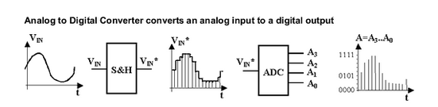
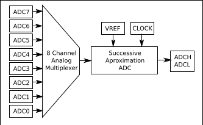

## ADC: Analog TO Digital   Converter

Un ADC es un sistema que mide una magnitud analógica proporcionando un valor digital. Se utilizan para medir voltajes normalmente.

En Arduino el ADC es de 10 bits, es decir divide el rango de voltaje que mide (normalmente 0-5V) en 1024 partes. 

Se pueden conseguir 9600 muestras (samples) por segundo con el sistema Arduino. Podemos modificar esta velocidad usando el preescaler (del que ya hablamos cuando lo hicimos sobre los Timers), en [este enlace](http://yaab-arduino.blogspot.com.es/2015/02/fast-sampling-from-analog-input.html) se comenta cómo hacerlo.

Usando el IDE Arduino la forma natural de obtener valores analógicos como ya hemos visto es usando

  analogRead(EntradaAnalógica)

Aunque en un Arduino UNO disponemos de 6 entradas analógicas, internamente sólo existe un medidor, que mediante un multiplexor accede a cada una de las entradas.

El hardware de arduino permite  leer datos ADC en 2 modos:

* Single Conversion Mode: una sola muestra
* Free Running: medida continua

Por defecto se usa la segunda opción. Podría ser deseable usar la primera para bajar el consumo.

Por supuesto que podemos añadir hardware externo más avanzado con capacidad de usar más bits de resolución y con mayor velocidad, por ejemplo usando el chip ADS1115 podrías alcanzar resoluciones de 16 bits. Además este chip nos permite amplificar la señal usando lo que se conoce como PGA (Ganancia). Os dejo un [excelente tutorial](https://www.luisllamas.es/entrada-analogica-adc-de-16-bits-con-arduino-y-ads1115/) sobre cómo usarlo conectándolo vía I2C.

### Cambiando el rango de medida

Podemos cambiar el rango de voltaje a medir usando la función analogReference que configura el voltaje de referencia usado por la entrada analógica. La función analogRead() devolverá un valor de 1023 para aquella tensión de entrada que sea igual a la tensión de referencia. Las opciones son:
* DEFAULT: Es el valor de referencia analógico que viene por defecto que es de 5 voltios en placas Arduino y de 3,3 voltios en placas Arduino que funcionen con 3,3 voltios.
* INTERNAL: Es una referencia de tensión interna de 1.1 voltios en el ATmega168 o ATmega328 y de 2.56 voltios en elATmega8.
* EXTERNAL: Se usará una tensión de referencia externa que tendrá que ser conectada al pin AREF.
En el siguiente vídeo veremos esto en detalle.

En [este vídeo](https://www.youtube.com/embed/J3vdHNQJI54) se habla del ADC.

### Referencias

Para ampliar sobre el tema puedes leer:

[Midiendo el propio Vin/Vcc](http://jeelabs.org/2012/05/04/measuring-vcc-via-the-bandgap/)

[ADC Avanzado](https://www.pjrc.com/teensy/adc.html)
