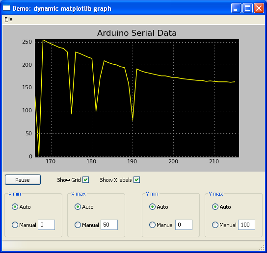
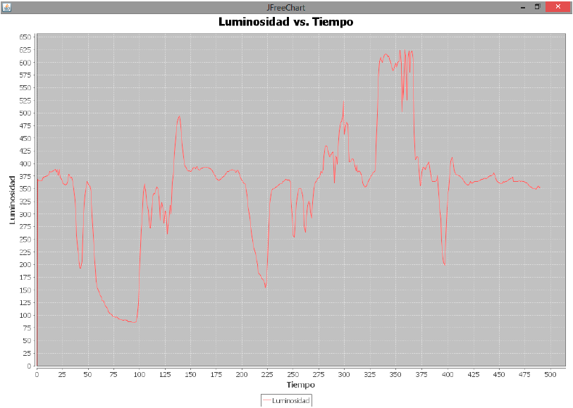

# Tema 11 - Procesado de datos desde el PC

## Acceso a servicios externos

Una vez tenemos operativo nuestro hardware y somos capaces de descargar una página web desde nuestro Arduino, es el momento de pasar al siguiente nivel.

Y este no es otro que acceder a servicios online. Estos servicios online, o en la nube como ahora se suele decir, exponen una serie de reglas para acceder a ellos.

Es lo que se conoce de forma genérica como un API (Application Programming Interface). 

Existen multitud de estos servicios, algunos nos permite publicar contenidos en redes sociales (como Twitter y Facebook) otros nos facilitan el almacenar nuestros datos y mostrarlos como gráficas. Además estos servicios  dan una dimensión social a nuestros datos pudiendo compartirlos con otros usuarios.

Uno de los más conocidos servicios que nos permiten gestionar y visualizar nuestros datos es el antes gratuito y conocido como Pachube, luego llamado Cosm y de momento Xively.

Veamos cómo acceder a este servicio:

* Podemos encontrar su API, describiendo su servicio en https://xively.com/dev/docs/api/
* En el siguiente enlace https://xively.com/dev/tutorials/arduino_wi-fi/  podemos ver cómo subir nuestros datos usando un Arduino UNO + shield wifi. En concreto usa peticiones REST , unas de las más usadas y para ello utilizar la librería httpclient https://codeload.github.com/amcewen/HttpClient/zip/master

Se suele usar la librería httpclient en lugar de usar directamente la librería ethernet porque nos facilita el acceso a las urls más complejas además de poder usar características de sesión propias de HTTP.

Un ejemplo de esto puede ser estos parámetros necesarios para subir datos al antiguo pachube

    http_client_parameter pachube_api_header[] = {
    { "X-PachubeApiKey","afad32216dd2aa83c768ce51eef041d69a90a6737b2187dada3bb301e4c48841" }
    ,{ NULL,NULL }
    };

Podemos encontrar más ejemplos sobre el uso de REST y HTTP en http://interactive-matter.eu/how-to/arduino-http-client-library/

En este otro ejemplo https://www.jotschi.de/Technik/2012/04/21/arduino-ethernet-shield-simple-rest-api-example.html podemos ver cómo puede actuar Arduino como servidor soportando peticiones REST 

Podemos encontrar alternativas a este servicio en http://forum.arduino.cc/index.php?topic=124577.15 , como por ejemplo el servicio  Opensource http://emoncms.org/ o https://parse.com/

## Python

Python es uno de los lenguajes más usados en la actualidad en el mundo de la hardware y software abierto. Es sencillo, muy completo y rápido de aprender.

Nada más sencillo que usar python para comunicarnos con Arduino. 

En primer lugar hay que instalar pySerial http://pyserial.sourceforge.net/ . Lo descargamos y los instalamos ejecutando:

    python setup.py install,

En Ubuntu podemos instalarlo haciendo 

    sudo apt-get install python-serial

Para leer datos podemos usar este sencillo programa:

    import serial
    ser = serial.Serial('/dev/tty.usbserial', 9600) ; usamos el puerto adecuado (COMx en windows)
    while 1:
        print (ser.readline());

Escribir datos a Arduino también es muy sencillo:

      import serial 
      ser = serial.Serial('/dev/tty.usbserial', 9600)
      ser.write('5')

Para abrir las conexiones conectaremos al mismo dispositivo (con el mismo nombre) que conectamos el entorno.

En linux se suele crear un link  entre el dispositivo que se usa y /dev/tty.usbserial para facilitar la Programacion

    sudo ln -s /dev/serialDevi /dev/MYSerial  

La mayoría de los recursos asociados a python y arduino los podemos encontrar en la página de python para arduino http://playground.arduino.cc/Interfacing/Python

### Usando APIs

Una de las características más utilizadas de Python es la facilidad con la que podemos acceder a APIs de terceros (como twitter, facebook, gmail...)

Vamos a ver un ejemplo de cómo acceder a gmail desde nuestro programa de Python http://geekytheory.com/arduino-python-smtp-gmail/

La idea de este proyecto es enviar un correo cuando un sensor produzca una medida considerada peligrosa. Simularemos esta medida con un sensor de distancia, suponiendo que la cercanía de un obstáculo supone un peligro.

El programa Arduino verificará el valor de los sensores y en caso de detectar algo anómalo enviará al programa python vía Serial y mensaje.

El programa  python en caso de recibir ese mensaje enviará el email con el asunto, mensaje y destinatario preestablecidos.

El código python del ejemplo sería el siguiente:

    import serial
    import time
    import smtplib

    USUARIO_GMAIL = 'micorreo@gmail.com'
    CONTRASENA_GMAIL = 'micontraseña'
    DESTINATARIO = 'destinatario@dominio.com'
    REMITENTE = 'micorreo@gmail.com'
    ASUNTO = ' ¡ Hay un intruso en su hogar. ! '
    MENSAJE = ' ¡ Su sensor de seguridad ha detectado movimiento en su casa. ! '
    arduino = serial.Serial('COM4', 9600, timeout = 3.0) #El puerto se abre inmediatamente en la creación de objetos, cuando se da un puerto.
    while True:
      lineaLeida = arduino.readline() #Guardo una línea leída desde el puerto serial
      print(lineaLeida) #Imprime la variable mensaje
      if lineaLeida[0] == 'H' : #Si la línea contiene a 'H' envía un correo electrónico
        enviar_correo_electronico() #Envío un correo electrónico
        time.sleep(0.5) #Suspende la ejecución por 0.5 segundos

    def enviar_correo_electronico():
      print("Envíando e-mail")
      smtpserver = smtplib.SMTP("smtp.gmail.com",587) #Definimos el objeto 'smtpserver' con smptlib.SMTP, SMTP("",) Administra la conexión SMTP
      smtpserver.ehlo() #Este método prepara envíar un correo electrónico
      smtpserver.starttls() #Pone la conexión con el servidor SMTP en el modo de TLS.
      smtpserver.ehlo()
      smtpserver.login(USUARIO_GMAIL, CONTRASENA_GMAIL) #Iniciamos sesion en el SMTP server de Google
      header = 'To: ' + DESTINATARIO + '\n' #Construimos el 'HEADER' para envíar el correo electrónico
      header += 'From: ' + REMITENTE + '\n'
      header += 'Subject: ' + ASUNTO + '\n'
      print header
      msg = header + '\n' + MENSAJE + ' \n\n' #Concatenamos el'HEADER' y el 'MENSAJE' del correo electrónico
      smtpserver.sendmail(REMITENTE, DESTINATARIO, msg) #Envíamos el correo electrónico
      smtpserver.close() #Cerramos la conexión con el SMTP server de Google

### Graficos

Instalando la librería matemática MathPlotLib podemos representar datos gráficamente en tiempo real. Más detalles en http://www.blendedtechnologies.com/realtime-plot-of-arduino-serial-data-using-python

El código https://github.com/gregpinero/ArduinoPlot/tree/master  implementa un monitor  https://github.com/gregpinero/ArduinoPlot/blob/master/Arduino_Monitor.py de arduino que permanentemente está recibiendo datos de Arduino via puerto serie (por defecto por el COM4 y a 9600 pero facilmente modificable) y código https://github.com/gregpinero/ArduinoPlot/blob/master/wx_mpl_dynamic_graph.py para ir visualizando los datos a medida que estos llegan

### Guardando datos

Un ejemplo para hacerlo [en windows](https://www.instructables.com/id/Using-an-Arduino-and-Python-to-plotsave-data/) y otro [en linux](https://www.instructables.com/id/Sending-Data-From-Arduino-to-Python-Via-USB/)

### Referencias

Podéis aprender mucho más sobre cómo usar Arduino y python en estos tutoriales [Tutorial de python y arduino](http://www.toptechboy.com/using-python-with-arduino-lessons/)

[Tutorial sobre lectura y escritura de datos en python](https://engineersportal.com/blog/2018/2/25/python-datalogger-reading-the-serial-output-from-arduino-to-analyze-data-using-pyserial)

[Curso gratuito de python by Googe](https://developers.google.com/edu/python/)

## Java

Para conectar con Arduino desde Java es necesario que tengamos la librería rxtxSerial.dl y el jar RXTXcomm.jar accesibles desde nuestro proyecto. Por defecto vienen en la instalación de Arduino en la carpeta lib.

Podemos añadir estos ficheros al classpath o bien incluirlos en nuestro proyecto. Podemos ver detalles de cómo hacerlo en el entorno NetBeans http://kinleyphycom.blogspot.com.es/2009/04/connecting-arduino-and-java-in-windows.html

Una vez incluidas las librerías sólo tenemos que abrir el stream del puerto serie y con un InputStream y un OutpuStream leer (read) y escribir (write) datos. Veamos un ejemplo

      static InputStream input;
      static OutputStream output;
      static CommPortIdentifier portId;
      static SerialPort port;

      public static void main(String[] args) {

          Preferences.init(); // Recuperamos la preferencias
          portId = CommPortIdentifier.getPortIdentifier(Preferences.get("serial.port"));

          port = (SerialPort)portId.open("", 4500);
          input = port.getInputStream(); //obtenemos stream de entrada
          output = port.getOutputStream(); //obtenemos stream de salida
          port.setSerialPortParams(Preferences.getInteger("serial.debug_rate"),
          SerialPort.DATABITS_8,
          SerialPort.STOPBITS_1,
          SerialPort.PARITY_NONE);

          try{
            while(true){
              while(input.available() > 0) {
              System.out.print((char)(input.read())); //Enviamos a la consola los datos que leemos
              }
            }
          }
          catch(gnu.io.NoSuchPortException nsp) {
            System.err.println("ERROR: " + nsp.getMessage());
          }
          catch(gnu.io.UnsupportedCommOperationException usp) {
            System.err.println("ERROR: " + usp.getMessage());
          }
          catch(gnu.io.PortInUseException pie) {
            System.err.println("ERROR: Port " + port + " is already in use\nCLose the port and restart.");
          }
          catch(java.io.IOException ioe) {
            System.err.println("IO ERROR: " + ioe.getMessage() );
          }
          catch(Exception exe) {
            System.err.println("ERROR: Unexpected error occured \n" + exe.getMessage() );
          }
      }

      }

### Gráficos en tiempo real

Siguiendo las indicaciones de este enlace http://panamahitek.com/2013/09/22/graficas-de-sensores-en-tiempo-real-con-arduino-java-y-jfreechart/

Para realizar los gráficos se usa la conocida librería abierta JFreeChart http://www.jfree.org/jfreechart/

Para utilizarla en nuestro proyecto descargamos JFreeCharts y jCommons http://www.jfree.org/jcommon/ e importamos en nuestro proyecto
