## Programación de Arduino

### Opciones de programación de Arduino

Veamos las diferentes opciones que tenemos para programar Arduino:

### Arduino IDE

[IDE Arduino](http://arduino.cc/en/Main/Software)|entorno multiplataforma que permite la edición, compilación y la programación de Arduino usando código.

### [ArduinoBlocks.com](http://www.arduinoblocks.com)

ArduinoBlocks es un entorno de programación visual por bloques que nos permite programar nuestra placa Arduino o compatible de forma sencilla, evitando la complejidad de las sentencias C++

Además nos permite programar nuestro Arduino sin instalar (prácticamente) nada en nuestro ordenador

Empezaremos seleccionando el tipo de placa Arduino que vamos a usar y a continuación añadiremos el hardware que usemos conectándolo a las patillas correspondientes.

Tiene la gran ventaja de incluye los bloques para multitud de componentes fácilmente identificables por sus imágenes.

Otra gran ventaja de ArduinoBlocks es que nos permite programar multitud de placas además de Arduino UNO (Mega, micro, nano, ... )  y hasta placas más modernas como nodeMCU o ESP8266

### BitBloq

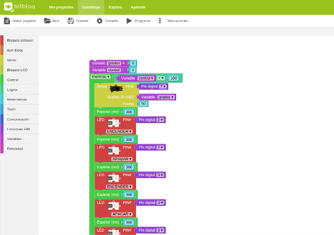

[Bitbloq](http://bitbloq.bq.com/ "bitbloq") es un entorno de desarrollo visual basado en la programación con bloques. Es muy sencillo e intuitivo de usar y solo necesitamos el navegador para usarlo. Existen alternativas offline como Visualino.

Tiene el inconveniente de que soporta casi únicamente los componente que vende el fabricante Bq que es quien los ha creado

### CodeBender

[Codebender](http://codebender.cc "codebender") es un entorno de desarrollo totalmente basado en aplicaciones web, decir, sólo necesitamos un navegador web para poder desarrollar con Arduino. Permite la edición, compilación y la programación de Arduino. Podéis probarlo en [https://codebender.cc/](https://codebender.cc/)

### mBlocks

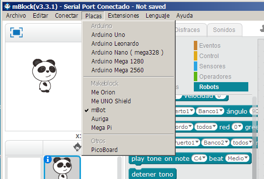

[mBlock](https://ide.mblock.cc/) es una plataforma de programación con bloques (aunque también permite trabajar con código) basada en Scratch que nos permite programar muchos tipos de placas, como Arduino y robots como los de makeBlocks. 

El que esté integrado dentro de Scratch permite hacer que nuestro hardware interaccione de manera sencilla con el programa en nuestro PC.

En este [vídeo](https://youtu.be/pg4lbbd4DK8) vamos ver qué entorno elegir según sean nuestros componentes.

### Introducción a [ArduinoBlocks.com](http://www.arduinoblocks.com)

Para aprovechar todas las ventajas de ArduinoBlocks debes registrarte, pero si no quieres hacerlo puedes trabajar también en el modo de prueba. Las ventajas de estar registrado es que tus programas se guardan automáticamente en la nube, puedes compartirlos y además puedes usar más placas además de Arduino UNO

### Parpadeando el led interno

Vamos a empezar haciendo parpadear el led interno de la placa Arduino

ArduinoBlocks es un entorno de programación visual por bloques que nos permite programar nuestra placa Arduino o compatible de forma sencilla, evitando la complejidad de las sentencias C++

Además nos permite programar nuestro Arduino sin instalar (prácticamente) nada en nuestro ordenador

Empezaremos seleccionando el tipo de placa Arduino que vamos a usar (normalmente Arduino UNO) y añadimos los siguientes bloques para que produzca el parpadeo.

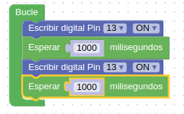

En este [vídeo](https://youtu.be/S5Bf6cmcDs8) vemos cómo subir el [programa](http://www.arduinoblocks.com/web/project/283245) a nuestra placa Arduino UNO.

Puedes utilizar el programa que he compartido haciendo clic en el siguiente enlace al [programa](http://www.arduinoblocks.com/web/project/174285)

##### Ejercicio: Cambiar la velocidad de parpadeo

#### Envío de datos al PC

La comunicación serie se produce vía USB entre Arduino y el PC, vamos a hacer un ejemplo en el enviamos información entre nuestra placa Arduino y el PC

Vamos a enviar "On" y "Off" al PC

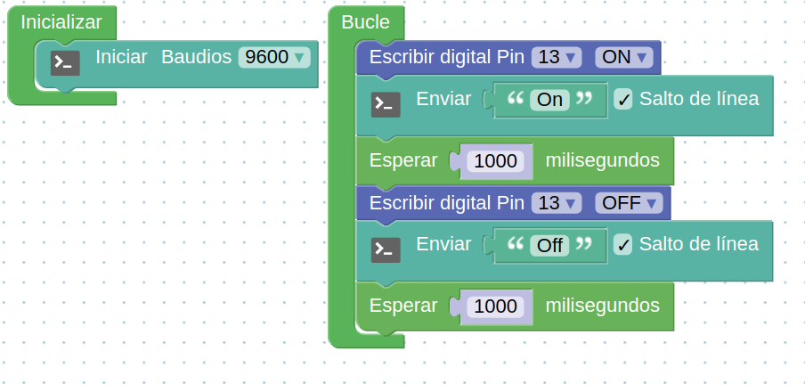

En este [vídeo](https://youtu.be/zv9esePKoAo) vamos a ver cómo funciona y como ver los datos que intercambia PC y Arduino usando este [programa](http://www.arduinoblocks.com/web/project/283322)

Ahora abrimos la consola y vemos los mensajes

* Detectamos el puerto
* Configuramos la velocidad
* Necesitamos un programa para ver los datos

En todo momento podemos ver el código (pero no editarlo) desplegando la opción Bloques y pulsando **Ver Código**

Ahora vamos a ver como hacer estos ejemplos en otro entorno como es BitBloq y publicaremos la diferencias entre los dos

### Introducción a la programación con Bitbloq

Bitbloq es un entorno de programación visual por bloques que nos permite programar nuestra placa Arduino o compatible de forma sencilla, evitando la complejidad de las sentencias C++.

Podemos acceder directamente desde su web <http://BitBloq.bq.com/>

Como verás cuando entres a su página, funciona con Chrome en todos los sistemas operativos, y el se encarga de avisarte si necesitas drivers o cambiar algo en tu sistema.

A lo largo de estos vídeos veremos algunas de sus características más importantes. Puedes encontrar más tutoriales en la página [oficial de BitBloq](http://diwo.bq.com/tag/bitbloq/)

Veamos un ejemplo sencillo:

[Vídeo de ejemplo básico ](https://youtu.be/rOdMRhhQTUs)

[ejemplo Parpadeo](https://github.com/javacasm/ArduinoBasico/blob/master/bitbloq/1.%20parpadeo.json)

[Vídeo "Cómo ver código C++ de un programa BitBloq"](https://youtu.be/cg1YNVSprdo)

Desde BitBloq siempre podemos ver el código Arduino generado. De momento no podemos modificar este código pero si copiarlo y llevarlo al IDE de Arduino

[Vídeo "Transfiriendo el programa BitBloq a Arduino"](https://youtu.be/gMe2YDgUUQE)

Bitbloq nos permite programar nuestro Arduino sin instalar (prácticamente) nada en nuestro ordenador. Sólo tenemos que pulsar sobre el botón cargar lo que hace que se compile el código, se detecte la placa y se envíe el programa a nuestro Arduino

## Sentencias de control

[Vídeo sobre sentencias de control ](https://youtu.be/dakh7MTxpBg)

Las sentencias de control son aquellas que nos permite modificar el orden o el modo en el que se ejecutan los bloques de nuestro programa.

##### Variables

Para utilizar las sentencias de control necesitaremos el concepto de variables: que no es otra cosa que un lugar donde almacenar un valor que puede se modificar si así lo queremos

[Vídeo sobre variables](https://youtu.be/Os-8oHBKsQU)

Con las variables podemos realizar operaciones matemáticas

[Vídeo sobre operaciones con variables](https://youtu.be/nvRUCZERScE) 

[ejemplo](https://raw.githubusercontent.com/javacasm/ArduinoBasico/master/bitbloq/operaciones%20variables.json)

### Sentencias de control

Vamos a ver las sentencias de control que nos van a permitir decidir cómo se van ejecutando las órdenes de nuestro programa, si se repiten, si se ejecutan en función de una u otra razón

[Vídeo sobre sentencias de control](http://youtu.be/0Af8VdF6h24)

### Bucle **for**

Empezamos por la sentencias **for** que nos va a permitir decir que una parte de nuestro programa se repita un número determinado de veces.

[\[Vídeo\]](https://youtu.be/mIAgTdc4oC8) [\[ejemplo\]](https://raw.githubusercontent.com/javacasm/ArduinoBasico/master/bitbloq/bucle%20for.json)

Necesitamos declarar una variables que actuará como contador y definir el valor inicial que tendrá la variable y el final, realizándose tantos como pasos como valores enteros haya entre ambas.

### Bucle **while**

También podemos decidir que se repitan unas sentencias en función de una determinada condición usando la sentencia **while**

[\[Vídeo\]](https://youtu.be/RVcaaz1NYjk) [\[ejemplo\]](https://raw.githubusercontent.com/javacasm/ArduinoBasico/master/bitbloq/bucle%20while.json)

Usaremos la sentencia de control **while** para los bucles donde el número de veces que se repite no está definido desde el principio

### Bloque **if** : sentencias condicionales

Una sentencia condicional permite decidir si se ejecutan o no determinadas órdenes

[Vídeo sobre sentencias condicionales](http://youtu.be/dXpDCOzsO2U)

[vídeo](https://youtu.be/RTtn_77pZY4)

[ejemplo](https://raw.githubusercontent.com/javacasm/ArduinoBasico/master/bitbloq/condiconales.json)

Las sentencias condicionales permiten ejecutar un código y otro según se cumpla o no una determinada condición. Esta condición será una validación que definiremos con operandos.

Podemos hacer que en caso de que se cumpla se ejecute un código (es el bloque if) y en caso de que no se cumpla la condición se ejecute otro (bloque else). Veamos un ejemplo

[vídeo](https://youtu.be/-f_htl5TQN8)
[ejemplo](https://raw.githubusercontent.com/javacasm/ArduinoBasico/master/bitbloq/condicional%20compleja.json)

### Condicionales-complejas

[\[vídeo\]](http://youtu.be/en_Y-_wVyO0) [\[ejemplo\]](https://raw.githubusercontent.com/javacasm/ArduinoBasico/master/bitbloq/condicional%20compleja.json)

La condición que determina si se ejecuta un bloque u otro o si salimos de un bloque while puede contener varias comprobaciones.

Entre estas condiciones utilizaremos operadores lógicos que pueden ser AND o OR.

-   Estas condiciones se tendrán que cumplir todas en el caso del operador AND.

-   Con que se cumpla una de ellas se dará por válida toda la condición.

### Envío de datos al pc

En el siguiente [Vídeo](http://youtu.be/uAy_reYl8_Y) vamos a ver cómo enviar información entre Arduino y el PC usando Bitbloq

[\[vídeo\]](https://youtu.be/hy9t76RLeBU) [\[ejemplo\]](https://raw.githubusercontent.com/javacasm/ArduinoBasico/master/bitbloq/comunicacion%20serie.json)

Podemos enviar contenidos entre nuestra placa y el PC usando las sentencias de comunicaciones. Usaremos print para enviar algo (puede ser el valor de una variable o un texto) al PC o println para enviar y pasar a la siguiente línea.

### Variables locales vs variables globales

En este [Vídeo](https://youtu.be/U3ulo7rAE58) hablamos sobre los diferentes tipos de variables dentro de un programa

[ejemplo](https://raw.githubusercontent.com/javacasm/ArduinoBasico/master/bitbloq/variables%20globales.json)

Podemos definir variables locales o globales. Una variable global estará definida y por tanto mantendrá su valor en todo el programa, mientras que una variable local solo se definirá donde se haya declarado.

Las variables globales mantienen su valor entre las distintas iteraciones que se realizan del programa.

#### Creando bucles sin sentencias de control

Podemos usar la forma cíclica (y unas variables globales) en la que se ejecutan los programas en Arduino para hacer un bucle sin más estructuras de control que una simple variable global

[ejemplo](https://raw.githubusercontent.com/javacasm/ArduinoBasico/master/bitbloq/ejemplo%20bucle%20arduino.json)

### Usando el IDE de Arduino

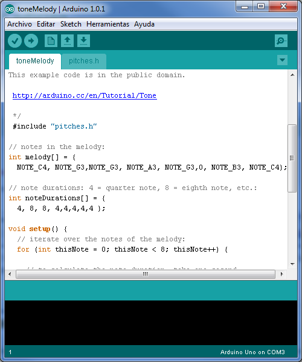 

El Entorno de Programación Integrado (IDE) de Arduino es sencillo y a la vez potente, incluyendo casi todas las funcionalidades que uno espera de un IDE actual.

Es un IDE multiplataforma, estando disponible para descargar directamente para Windows, Linux y MaxOS. Al ser una herramienta de código libre podemos descargar también el código fuente para compilarlo.

Está desarrollado en Java y deriva del IDE de Processing y de Wiring.

Ha sido diseñado teniendo en mente que sus usuarios no son expertos desarrolladores y que lo esencial es que los recién llegados sean capaces de familiarizarse con él.

Incluye un editor de código que resalta la sintaxis, indicando cuando es correcta, indicando si las llaves están bien emparejadas y organizando el código de forma clara.

Además el entorno incluye todo lo necesario para compilar y descargar las aplicaciones al microcontrolador, sin necesidad de que el usuario conozca la complejidad de este proceso.

El entorno viene con una librería llamada Wiring (procedente de dicho proyecto) que facilita el programar pensando en las entradas y las salidas.

El código que se desarrolla es C/C++, aunque el usuario solo incluye las funciones **setup** y **loop**

Usaremos las versión 1.8.12 (o superior si se actualizara)

#### Instalación del entorno

[Descarga del tutorial de instalación](https://drive.google.com/file/d/1yIsnzA4-WWONr2s-3fD58h0HnHzaARYt/view?usp=sharing)

#### Descargando el programar a Arduino

Vamos a comenzar viendo paso a paso una descarga de un programa a Arduino.

Intentaremos hacer una lista paso a paso para poder detectar errores en el caso de que se produzcan

[Enlace para descarga: Primeras pruebas con Arduino](https://drive.google.com/file/d/15zHSVEUj-ouiWezT7ULY0VgD4JQOQ4Fz/view?usp=sharing)

En el siguiente vídeo podemos ver el paso a paso de la descarga de un programa a una placa Arduino

### Comenzando a programar con Arduino

#### Comenzando a programar

Como hemos visto podemos encontrar multitud de ejemplos en el propio IDE de Arduino, de ellos podemos aprender la sintaxis y las posibilidades que el entorno tiene.

Vamos a hacer unos ejemplos nosotros que sin entrar en detalles técnicos nos van a permitir ir haciéndonos con el entorno.

### Programa con contador

Introducimos el siguiente programa en el entorno. En el se irá incrementando la variable _i_ y se enviará su valor al pc por el puerto de comunicaciones.

    void setup(){
      Serial.begin(9600);
    }

    int i=0;
    void loop() {
      Serial.print("hola ");
      Serial.println(i);
      i=i+1;
    }

Vamos a analizar el programa:

-   Todos los métodos que empiezan con Serial, se refieren a comunicaciones con el pc, en la línea **Serial.begin(9600)** estamos diciendo que vamos a iniciar (**begin**) las comunicaciones a una     velocidad de **9600bps** (baudios o bits por segundo). **Serial.print** lo que lleva a continuación al PC. Si utilizamos **println** le estamos indicando de  después de imprimir salte a la siguiente línea.
-   Sabemos el método **setup** se ejecuta sólo al principio una vez para configurar todo. El método **loop** en cambio se ejecuta de forma repetitiva, con lo que el resultado será que nuestra variable **i** se va incrementando a cada paso en una unidad (podíamos haber abreviado el programa sustituyendo la linea **i=i+1;** por **i++** que significa lo mismo pero es más corta de escribir (los programadores de C tienen la tendencia hacer su código cuanto más corto mejor, no siempre atendiendo a la claridad...)

Descargamos el programa

después de haber comprobado que tenemos bien seleccionado nuestro modelo de placa y el puerto donde está conectada. Una vez descargada, abrimos la consola serie para ver el resultado

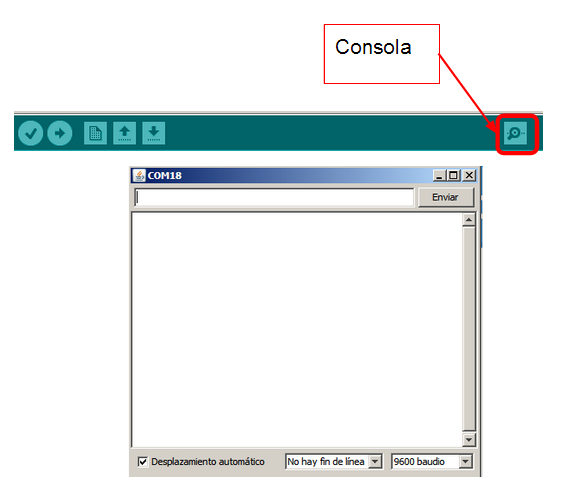

Cuidando de que la velocidad seleccionada será la misma que hemos indicado en el programa

Veremos como se producen una sucesión de línea con el texto "hola 1...."

En BitBloq hacemos el siguiente programa

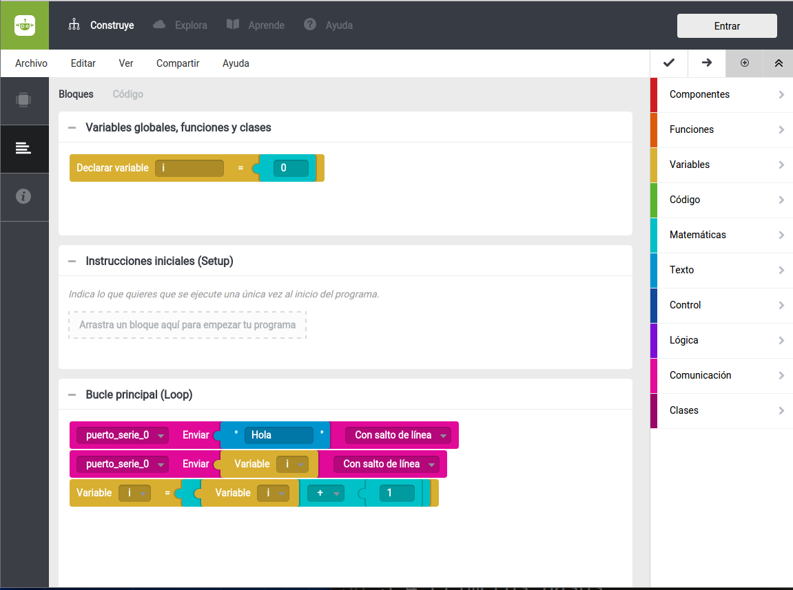

## Tiempos

Podemos ver las líneas se suceden a toda velocidad en el programa anterior. Ahora mismo el micro está funcionando todo lo rápido que puede (la única limitación es la velocidad a la que se envían datos al pc)

Para introducir una pausa podemos usar las funciones **delay** y **delayMicroseconds**. Veamos su uso

-   **delay(milisegundos)**: espera el número de milisegundos indicado
-   **delayMicroseconds(microsegundos)**: espera los microsegundos     indicados El número máximo que soporta es 16383 microsegundos

Así con solo introducir la siguiente línea detrás del incremento de la
variable i, conseguiremos que el programa se retrase

    delay(1000);

Ya que estamos hablando de tiempo veamos que otras funciones tiene
Arduino relacionadas con el mismo:

- **long millis()** : devuelve el número de milisegundos desde que se  encendió la placa. Se vuelve a poner a cero cada 50 días aproximadamente.
- **long micros()** : devuelve el número de microsegundos desde que se  encendió la placa. Se vuelve a poner a cero cada 70 minutos aproximadamente. **Tiene una resolución de 4 microsegundos.**

Con todo esto vamos a hacer un programa que envíe cada segundo el número de milisegundos que han pasado desde la ultima iteración. Intenta hacer el programa por ti mismo

Quedaría algo así:

    void setup(){
      Serial.begin(9600);
    }

    long mAnteriores; // Lo usaremos para almacenar el valor anterior

    void loop() {
      long mActuales=millis(); // leemos el valor actual de millis

      Serial.println(mActuales-mAnteriores);
      // restamos el anterior del actual y esos son los que han pasado

      mAnteriores=mActuales;
      // guardamos el dato actual para la siguiente iteración

      delay(1000);
    }

ArduinoBlocks dispone de una categoría entera para **Tiempo**

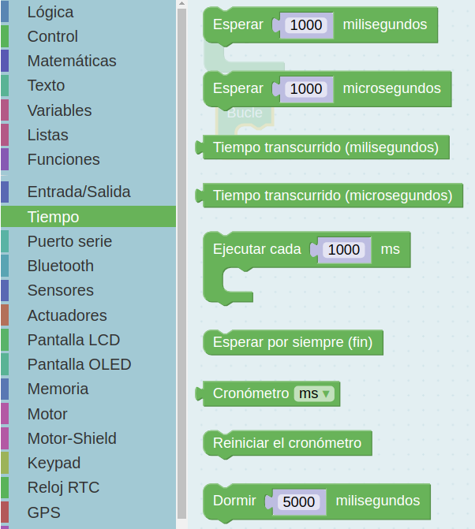

Me parece especialmente interesante su bloque **Ejecuar cada ...** que nos permite hacer de forma sencilla que algo se ejecute periódicamente (por ejemplo podíamos hacer que un led parpadeo cada 3 segundos mientras leemos los valores de un sensor) o el que ponga a nuestro Arduino a dormir (consiguiendo un bajo consumo) durante un tiempo.

### Sonido

Arduino puede reproducir sonido sin más que conectar un altavoz (mejor
un altavoz piezoelectrico de los que tienen los
pcs)

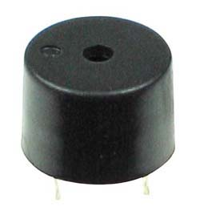

Uno de los terminales del altavoz a la salida digital que usaremos y el otro a GND. Dependiendo de las características del altavoz pudiera ser conveniente usar una resistencia entre el altavoz y la salida digital.

Podemos hacer sonidos con las siguientes funciones:

    tone(pin, frecuencia)
    tone(pin, frequencia, duracion)

-   Genera una señal cuadrada de la frecuencia y duración definidas.

Para afinar las frecuencias a las notas podemos consultar tablas como esta:

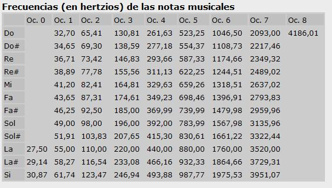

-   Interfiere con algunas funciones de los pines el 3 y 11 (el pwm que veremos más adelante)

        noTone(pin)

-   detiene la ejecución del tone actual
-   se utiliza para usar varios pines generando sonido

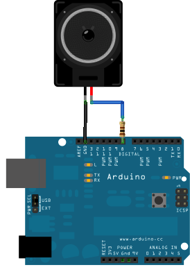

Podemos ver cómo se usan estas funciones en el ejemplo incluido en Arduino sobre el tema. Accederemos a él según la imagen siguiente

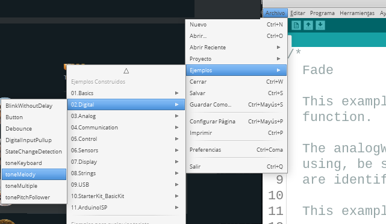

En BitBloq existen 2 formas de generar sonidos

-   Reproducir notas musicales: podemos escoger la nota que vamos a  reproducir y su duración
-   Seleccionar la frecuencia exacta que queremos reproducir y su duración

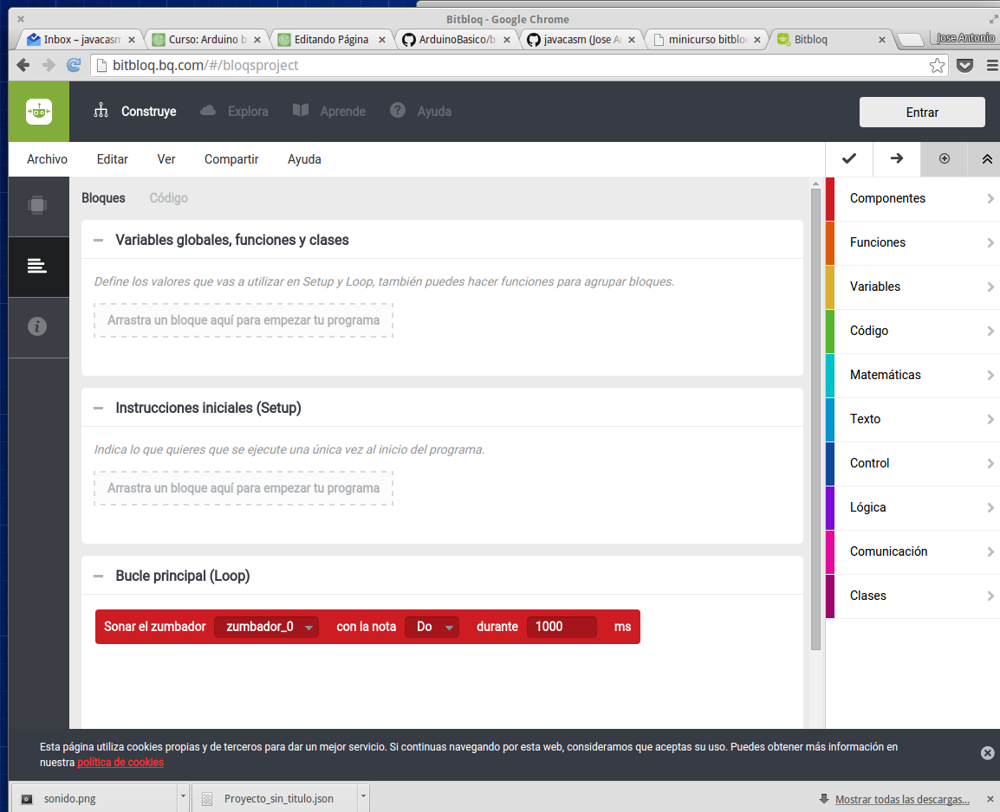

Se propone como ejercicio voluntario realizar alguna canción conocida, preferiblemente algo friki con Arduino. Comparte en los foros tu composición/interpretación.

Si quieres trabajar con el sonido en ArduinoBlocks, puedes encontrar los bloques en **Actuadores**

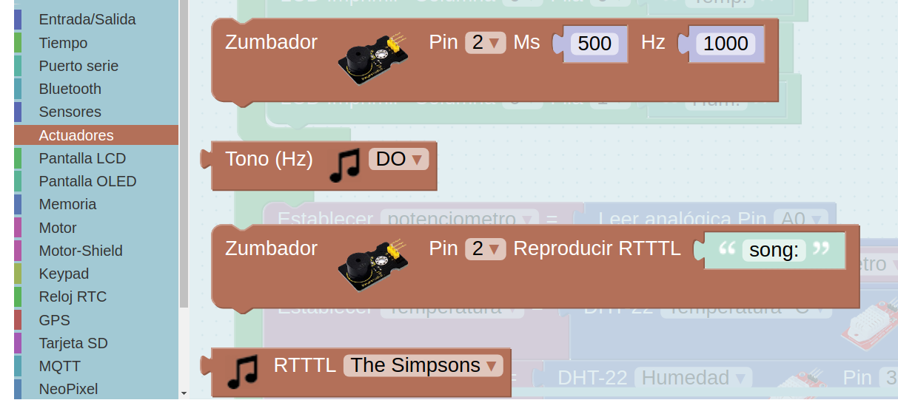

### Librerías

Una librería no es más que un conjunto de código empaquetado y al que podemos llamar desde nuestro programa

Facilita la tarea de desarrollar pues aprovechamos un código ya existente y nos abstrae y encapsula la dificultad de la tarea.

Para usarlas solo tenemos que importarlas desde nuestro código con un #include <...>

Si queremos instalarlas sólo hay que descargarlas y copiarlas en la carpeta libraries del directorio donde se guardan nuestros sketches de Arduino. Creamos un directorio con el nombre de la librería.

En el caso de Bitbloq, ahora mismo no se pueden usar librerías, de forma manual.

Aquí es donde ArduinoBlocks gana por goleada a BitBloq: de entrada ya incluye multitud de librerías. De hecho cuando seleccionamos un bloque de un sensor ya estamos utilizando su librería

### Uso de un sensor DHT11

Veamos un ejemplo sencillo de como ArduinoBlocks gestiona los sensores y sus correspondientes librerías.

Este es el montaje de un sensor DHT11 que mide la temperatura y la humedad ambiental (no te preocupes que más adelante lo veremos en detalle)

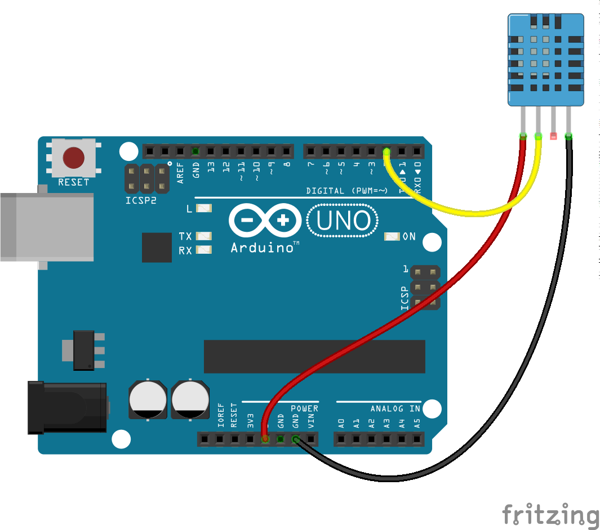

Si buscas entre los bloques de sensores de ArduinoBlocks lo encontrarás y verás que un programa sencillo que muestra los valores de humedad y temperatura sería

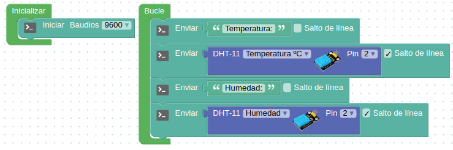

Si ahora pulsas para ver el código verás que ha añadido una sentencia **include** que es la hace referencia a la librería que se necesita para leer los datos del sensor

No te preocupes si el montaje te parece complejo, en el siguiente tema lo veremos en detalle

#### Librerías básicas en el IDE de Arduino

Veamos algunas de las librerías básicas que incluye el IDE de Arduino

-   EEPROM - permite leer y escribir en almacenamiento duradero
-   Ethernet - para conectar a internet
-   Firmata - comunicaciones usando un protocolo concreto
-   LiquidCrystal - manipulación de LCD
-   SD - lectura y escritura en tarjetas SD
-   Servo - control de Servos
-   SPI - comunicaciones con dispositivos usando SPI
-   SoftwareSerial - permite comunicaciones serie por otros pines
-   Stepper - control de motores paso a paso
-   Wire - comunicaciones I2C

#### Otras Librerías

Es sencillo añadir más librerías. Para ello el IDE de Arduino incluye un gestor de librerías. Puedes abrirlo desde el menu **Programa**->**Incluir librería**->**Gestor de librerías**

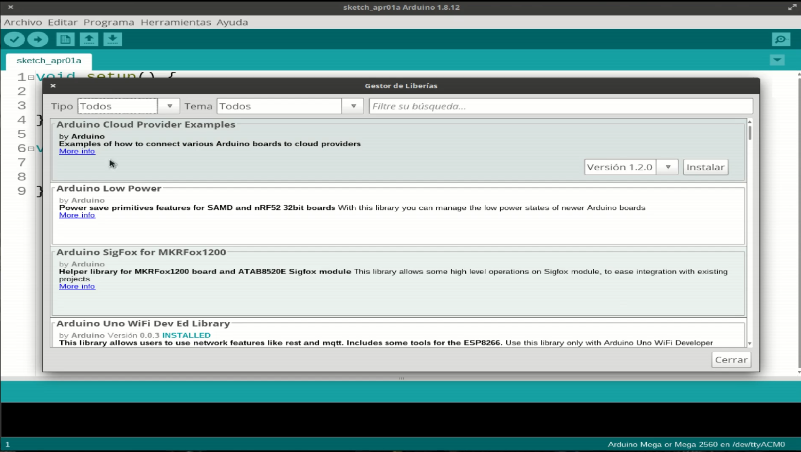

En [este vídeo](https://youtu.be/0X7pUANVNck) puedes ver cómo hacerlo.

##### Communication (networking and protocols):

-   [Messenger](http://www.arduino.cc/playground/Code/Messenger) - para procesar mensajes de texto provenientes del PC
-   [NewSoftSerial](http://sundial.org/arduino/index.php/newsoftserial/) - una versión mejorada de SoftwareSerial
-   [OneWire](http://www.arduino.cc/playground/Learning/OneWire) - permite la comunicación con dispositivos de Dallas (fabricante de dispositivos electrónicos) que usan este protocolo. Veremos un ejemplo en el módulo de comunicaciones.
-   [PS2Keyboard](http://www.arduino.cc/playground/Main/PS2Keyboard) - Lee caracteres desde un teclado PS2.
-   [Simple Message    System](http://www.arduino.cc/playground/Code/SimpleMessageSystem) - facilita la tarea de enviar mensajes entre Arduino y el PC
-   [SSerial2Mobile](http://code.google.com/p/sserial2mobile/) - envía mensajes de texto y email desde el movil (via comandos AT)
-   [Webduino](http://code.google.com/p/webduino/) - servidor web para usar con Arduino ethernet
-   [X10](http://arduino.cc/en/Tutorial/X10) - Envia señales del protocolo X10**usando los cables electricos domésticos
-   [XBee](http://code.google.com/p/xbee-arduino/) - Comunicaciones XBees en modo API**
-   [SerialControl](http://www.arduino.cc/playground/Code/SerialControl) - Control remoto de otros Arduinos por medio de comunicaciones serie

##### Sensing:

-   [Capacitive Sensing](http://www.arduino.cc/playground/Main/CapSense) - permite usar dos entradas como sensors capacitivos
-   [Debounce](http://www.arduino.cc/playground/Code/Debounce) - para hacer debounce en entradas

##### Pantallas y LEDs:

-   [Improved LCD
    library](http://web.alfredstate.edu/weimandn/arduino/LiquidCrystal_library/LiquidCrystal_index.html) mejora la libreria LCD library
-   [GLCD](http://www.arduino.cc/playground/Code/GLCDks0108) - permite manejar LCDs graficas basadas en el chip KS0108 o equivalente.
-   [LedControl](http://www.arduino.cc/playground/Main/LedControl) - maneja matrices de led con chips MAX7221 o MAX7219.
-   [LedControl](http://www.wayoda.org/arduino/ledcontrol/index.html) - librería alternativa para los chips anteriores.
-   [LedDisplay](http://www.arduino.cc/playground/Main/LedDisplay) - controla pantallas basadas en     [HCMS-29xx](http://sigma.octopart.com/23295/datasheet/Avago-HCMS-2973.pdf) con scroll.

Por estar basado en lenguajes estándar podemos portar (migrar) fácilmente librerías disponibles para otros sistemas

Estas librerías son compatibles con Wiring, los enlaces apuntan a la documentación.
-   [Matrix](http://wiring.org.co/reference/libraries/Matrix/index.html) - facilita el trabajo con Matrices de Leds
-   [Sprite](http://wiring.org.co/reference/libraries/Sprite/index.html) - Permite usar image básicas (sprite) en matrices leds

##### Frequency Generation and Audio:

-   [Tone](https://code.google.com/archive/p/rogue-code/wikis/ToneLibraryDocumentation.wiki) - genera sonidos de la frecuencia dada

##### Motores  y PWM:

-   [TLC5940](http://www.arduino.cc/playground/Learning/TLC5940) - facilita el usar el chip TLC594016 canales con PWM de 12 bit PWM.

##### Manejo del tiempo:

-   [DateTime](http://www.arduino.cc/playground/Code/DateTime) - facilita el trabajar con fechas y horas.
-   [Metro](http://www.arduino.cc/playground/Code/Metro) - ayuda a medir intervalos temporales fijos
-   [MsTimer2](http://www.arduino.cc/playground/Main/MsTimer2) - permite ejecutar tareas cada N milisegundos (usa 2 temporizadores).

##### Utilidades:

-   [PString](http://arduiniana.org/libraries/PString/) - clase ligera para imprimir
-   [Streaming](http://arduiniana.org/libraries/streaming/) - simplifica la manera de imprimir caracteres

#### Escribiendo nuestra propia librería

-   Para crear nuestra librería tenemos que generar nuestro código en C++
-   Crearemos una clase con nuestro código
-   Usaremos un fichero "nuestralibreria.h" donde declararemos nuestro interface (obligatorio que exista el constructor)
-   Un fichero "nuestralibreria.cpp" con nuestro código
-   Incluiremos todos los ficheros en una carpeta "nuestralibreria" en la carpeta libraries del directorio de usuario
-   Cerramos y abrimos el entorno Arduino para que la recompile y ya está disponible.

#### Ejemplo: Librería Servo

Un servo es un tipo de motor que permite hacer movimiento controlando el  ángulo de movimiento. Generalmente sólo pueden moverse 180º

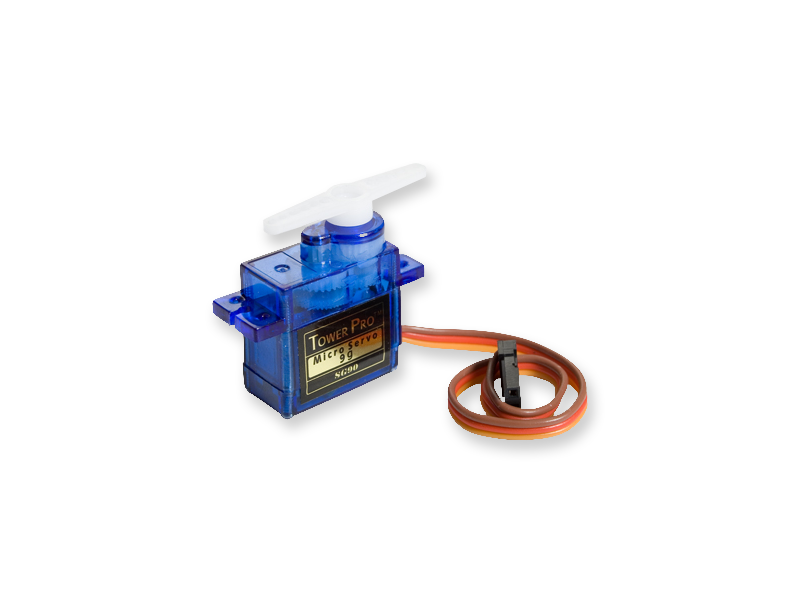

(Más adelante veremos más detalles sobre éste y otro tipo de motores)

Si lo hacemos en el IDE de Arduino usaremos la librería **Servo** que nos permite controlar hasta 12 servos en un Arduino UNO y 48 en un Arduino Mega

Tiene las siguientes funciones

-   [attach(pin) : conecta el objeto servo con el pin     dado](http://arduino.cc/en/Reference/ServoAttach)
-   [write(angul**0**) : establece la posición del     servo](http://arduino.cc/en/Reference/ServoWrite)
-   [read() : devuelve la posición del    servo](http://arduino.cc/en/Reference/ServoRead)
-   [attached()](http://arduino.cc/en/Reference/ServoAttached) : comprueba si está conectado
-   [detach()](http://arduino.cc/en/Reference/ServoDetach)[: desconecta el pin del servo](http://arduino.cc/en/Reference/ServoAttached)

La gran mayoría de los servos tienen el mismo esquema de conexión (a veces cambia el color negro por marrón y el blanco por amarillo/naranja)

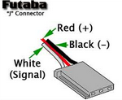

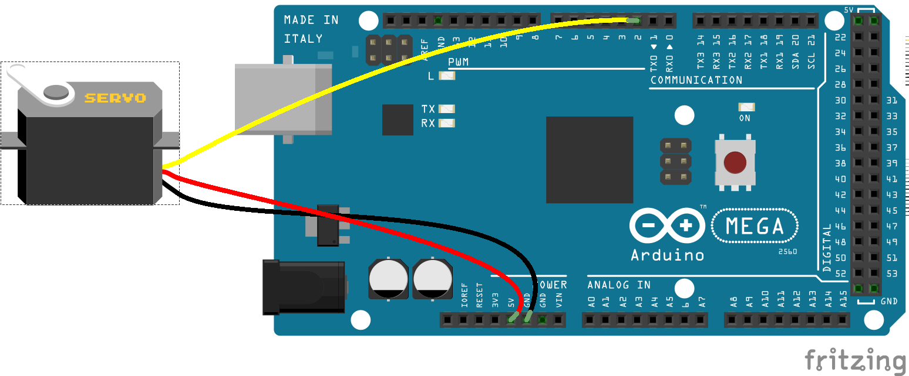

Veamos un ejemplo que podemos cargar desde el IDE de Arduino pulsando **Archivo**->**Ejemplos**->**Servo**->**Sweep** (que me he permitido traducir y modificar para usar el pin 2)

    #include <Servo.h>  // Incluimos la libreria Servo

    Servo myservo;  // creamos un objeto servo

    int pos = 0;    // guardamos la posicion del servo
    int potpin = 2; // pin donde está conectado el potenciómetro

    void setup() {
      myservo.attach(potpin);  // asignamos el pin 2 a nuestro servo
    }

    void loop() {
      for (pos = 0; pos <= 180; pos += 1) { // se mueve de 0 a 180
        // in steps of 1 degree
        myservo.write(pos);              // le dice al servo que vaya a esa posicion
        delay(15);                       // le damos al servo tiempo a reaccionar
      }
      for (pos = 180; pos >= 0; pos -= 1) { // ahora de 180 a 0
        myservo.write(pos);              // le dice al servo que vaya a esa posicion
        delay(15);                       // le damos al servo tiempo a reaccionar
      }
    }

Para usar la librería Servo con BitBloq podemos usar los bloques Servo. Existen 2 tipos de servos: los de rotación continua y los normales.

Veamos este ejemplo:

En ArduinoBlocks puedes encontrar las órdenes para el servo en la categoría de **Motores**. Vamos a hacer un proyecto sencillo con el montaje inicial

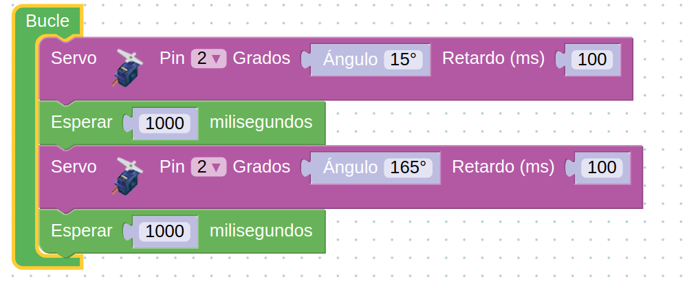

[Programa para Arduino Mega](http://www.arduinoblocks.com/web/project/283739) [Vídeo explicándolo](https://youtu.be/saAvPRxuEV4)

#### Ejemplo: Librería EEPROM

Guarda datos en la memoria no volátil EEPROM:

-   EEPROM.write(address, value) escribe el valor value en address.
-   EEPROM.read(address): devuelve el valor de la posición address.

En el tema de almacenamiento veremos ejemplos de acceso a EEPROM
