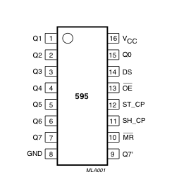

## Tipos de pantalals

Son muchas las posibilidades que tenemos para visualizar nuestros datos. En este capítulo vamos a hablar de 2 básicamente: LCD y LED. Son tecnologías bastante conocidas, cada una con sus ventajas e inconvenientes.

En el [siguiente vídeo](https://www.youtube.com/embed/MciTbzmYwsc) vamos a ver algunas de las posibilidades de visualización que existen para Arduino.

## LCD

Un LCD es la típica pantalla de las máquinas de vending, seguro que lo has visto miles de veces.

Podemos conectarla a Arduino de la siguiente forma:


El potenciómetro nos sirve para controlar el contraste.

Para programarlo se usará la librería LiquidCrystal que viene instala por defecto en Arduino.

El código es del ejemplo "Hello world" de la librería es muy sencillo:


Vemos que la instrucción para mostrar algo (lcd.print) se parece mucho a la instrucción para enviar datos por el puerto serie (Serial.print),  y no es casualidad.

La tecnología LCD tiene como ventaja que su consumo es realmente bajo, por contra requiere de muchos pines de conexión, podemos rebajar a 4 bit de datos y 4 de control. Para solucionar este problema podemos usar otras formas de comunicación I2C o SPI o un 595. Por eso existen muchas versiones de la clase LiquidCrystal, incluida en la librería del mismo nombre. La mayoría de estas clases implementan casi todos los métodos, definiendo así una jerarquía de clases. 

[Vídeo sobre LCD](https://www.youtube.com/embed/c4qsdo6XrnE)

### LCD I2C

Vamos a ver como ahorrar pines usando LCD con una placa externa de tipo I2C:

[Vídeo sobre LCD I2C - LiquidCrystal-I2C](https://www.youtube.com/embed/nIJpE4oVX1Y)

Para ello instalaremos una librería llamada "LiquidCrytal I2C"
Desde el menú **Programa** -> **Incluir librerías** -> **Gestor de Librerias**


En el buscador ponemos "LiquidCrystal I2C" e instalamos la librería que queremos usar. En este caso os recomiendo la de Frank Brabander que aparece como "Installed" en la imagen.

El uso de la librería I2C es el mismo, solo cambiando el include.

Para empezar a usarla, abrimos el ejemplo de la libreria "LiquidCrystal I2C" HelloWorld , cambiamos la direccion del LCD (Puede ser 0x27 o 0x30 o 0x3F) (Podemos buscar el valor usando "[I2C Scanner](https://github.com/javacasm/ArduinoAvanzadoPriego/blob/master/codigo/i2c_scanner/i2c_scanner.ino)"), conectamos el LCD y ajustamos el contraste con el potenciómetro de la placa.

Vamos a ver ahora un ejemplo más complejo:

```C++
#include <Wire.h>
#include <LiquidCrystal_I2C.h>

// Los usaremos para definir caracteres personalizados
uint8_t heart[8] = {0x0,0xa,0x1f,0x1f,0xe,0x4,0x0};
uint8_t bell[8]  = {0x4,0xe,0xe,0xe,0x1f,0x0,0x4};

LiquidCrystal_I2C lcd(0x3F, 16, 2);  //

void setup() {
  lcd.init();

  lcd.backlight();
  lcd.createChar(0, heart);
  lcd.createChar(1, bell);


  lcd.setCursor(6, 0);  // fila 1, columna 6
  lcd.write(0);  // Mostramos el caracter personalizado 0
  lcd.print("Ejemplo 1");
  lcd.write(0);

  lcd.setCursor(8, 1); // fila 2, columna 8
  lcd.print("Otro texto");
  lcd.write(1); // Mostramos el caracter personalizado 1
}

void loop() {
  lcd.scrollDisplayLeft();  // Movemos hacie la derecha el texto
  delay(1000);
}
```

### Más sobre LCDs

Existen muchas posibilidades de ampliar el uso de los LCD, como por ejemplo utilizando  gráficos de barras con  la [librería lcdBarGraph](http://playground.arduino.cc/Code/LcdBarGraph).  Lo que hace es usar caracteres definidos por el usuario con pequeños rectángulos de tamaños progresivos y cuando dibuja una barra, muestra todas los cuadrados enteros y el resto con el carácter correspondiente. Aunque esta librería funciona con la básica LiquidCrystal se puede implementar sin problema en cualquier versión de liquidcrystal.

Algo en lo que también se puede mejorar el aspecto al trabajar en Menús, dentro de nuestra aplicación.

Veamos las diferentes opciones:

* Menús en librería serie http://playground.arduino.cc/Code/Menu
* Menus en lcd http://forum.arduino.cc/index.php?topic=96104.0
* Menus en lcd http://forum.arduino.cc/index.php?topic=104762.0
* Los mejores y más completos menús https://code.google.com/p/phi-prompt-user-interface-library/

## Matrices de leds

Otra forma de visualización bastante utilizada son las matrices de Leds. En ellas un gran número de leds se colocan normalmente en forma de matriz y realizamos imágenes controlando sus encendidos. 

Veamos en [este vídeo](https://www.youtube.com/embed/EkwyEPTeuI8) el funcionamiento de algunas de ellas y ejemplos de uso y el código asociado.

La mayoría de estos programas que hemos visto funcionan con lo que se suele llamar arquitectura framebuffer. En ella existen dos variables de tipo matriz que contienen una, la imagen dibujada en un momento dado y la otra la siguiente imagen que queremos dibujar. Cuando esta segunda esté terminada, las intercambiamos  pasando a dibujar la actual. De esta manera minimizamos el tiempo de repintado, evitando parpadeos indeseados.

Tenemos 2 tareas:

* Una asociada a un temporizador que se limita a transferir los pixeles de la pantalla a los puertos. Para evitar parpadeos debería de ser lo más rápida posible, sin cálculos. La llamaremos Copia
* La que va dibujando en función de la "física" del programa. La llamaremos Dibuja

Si el dibujo es complejo tendremos 2 copias del array donde almacenar la pantalla. Copia usará la primera copia para transferir a los puertos (si es viable se pueden usar puertos directamente). Cuando Dibuja termine un frame, cambiará las copias y volverá a empezar a dibujar el frame en el otro.

Este planteamiento se puede usar tanto en matrices como en segmentos. Los segmentos se pueden abstraer como si fueran las filas.

## Hardware específico

Existen determinados chips que nos pueden facilitar el utilizar estas matrices, puesto que se encargan de las tareas de refresco, descargando de esta tarea a Arduino

Un ejemplo sencillo de este hardware específico sería usar **ShiftRegisters** (Registro de desplazamiento) que nos permiten encadenando varios de ellos controlar un alto número de leds con pocas salidas.



* PINS 1-7, 15 Q0 " Q7 Pines de salidas
* PIN 8 GND Ground, Vss
* PIN 9 Q7" Serial Out
* PIN 10 MR Master Reclear, active low
* PIN 11 SH_CP Shift register clock pin
* PIN 12 ST_CP Storage register clock pin (latch pin)
* PIN 13 OE Output enable, active low
* PIN 14 DS Serial data input
* PIN 16 Vcc Positive supply voltage

Veamos un vídeo donde se usa un  [registro de desplazamiento 595](https://www.youtube.com/embed/FH3hNBZOvBY)


con el código

```C++
//Pin connected to ST_CP of 74HC595
int latchPin = 8;
//Pin connected to SH_CP of 74HC595
int clockPin = 12;
////Pin connected to DS of 74HC595
int dataPin = 11;

void setup() {
  //set pins to output so you can control the shift register
  pinMode(latchPin, OUTPUT);
  pinMode(clockPin, OUTPUT);
  pinMode(dataPin, OUTPUT);
}

void loop() {
  // count from 0 to 255 and display the number
  // on the LEDs
  for (int numberToDisplay = 0; numberToDisplay < 256; numberToDisplay++) {
    // take the latchPin low so
    // the LEDs don't change while you're sending in bits:
    digitalWrite(latchPin, LOW);
    // shift out the bits:
    shiftOut(dataPin, clockPin, MSBFIRST, numberToDisplay);  

    //take the latch pin high so the LEDs will light up:
    digitalWrite(latchPin, HIGH);
    // pause before next value:
    delay(500);
  }
}
```

Otro chip que se usa mucho (por ejemplo en las enormes pantallas Leds de los centros comerciales) es el TLC5940.

Veamos un ejemplo usando el chip TLC5940 capaz de controlar 16 led con 4096 niveles de intensidad y con posibilidad de establecer un nivel de iluminación particular para cada uno.

[Vídeo Display led con TLC5940](https://www.youtube.com/embed/LRQ3S20c2kQ)

Ejemplo de montaje de TLC5940


El código usando la librería TLC5940 es sencillo, por ejemplo para repetir nuestro querido ejemplo Kit

```C++
#include "Tlc5940.h"

void setup(){
  Tlc.init();
}

void loop()
{
  int direction = 1;  // Vamos hacia abrriba o abajo
  for (int channel = 0; channel <  16; channel += direction) {

    Tlc.clear();  // apagamos todos

    if (channel == 0) {  // llegamos a un extremo invertimos la direccion
      direction = 1;
    }
    Tlc.set(channel, 4095);  // iluminamos a maximo brillo el que toca
    if (channel == 15) {  // Llegamos al otro extremo invertimos
      direction = -1;
    }

    Tlc.update();  // actualiza los leds con los valores actuales

    delay(75);
  }

}
```
