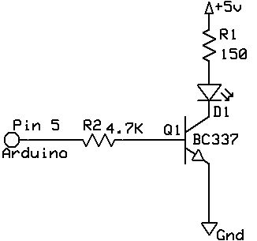
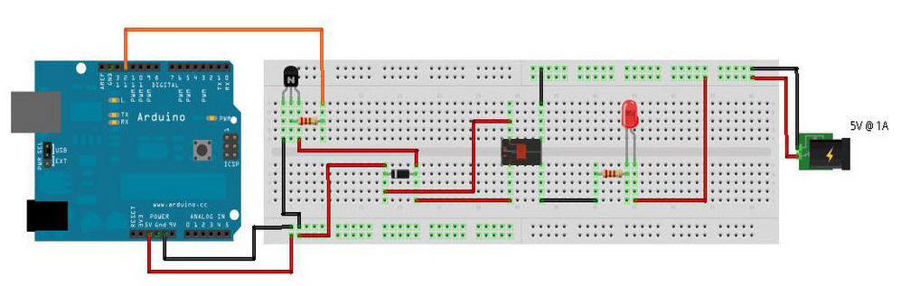
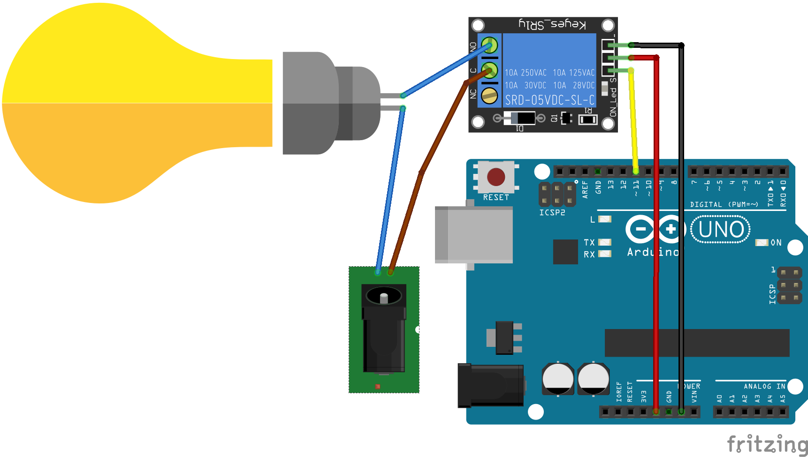
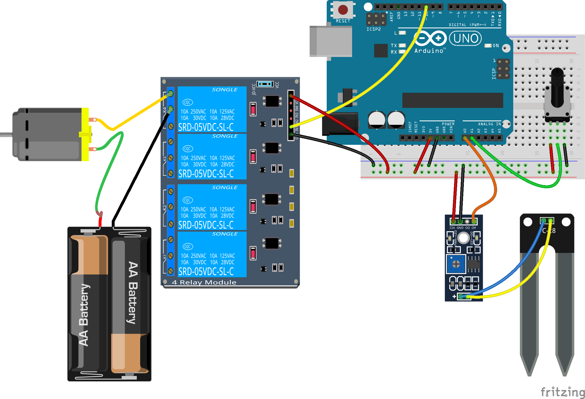

## Tema 9 - Control de potencia

En este tema vamos a aprender a controlar dispositivos que requieren de más potencia para funcionar,como pueden ser los motores o los dispositivos que tenemos en las casas

Empezaremos con una introducción a la electrónica de potencia.

[Vídeo sobre electrónica de potencia](https://youtu.be/8xaS2t1M5R4)

### Controlando la potencia

Cuando necesitemos trabajar con potencia, necesitaremos usar electrónica externa. Usaremos circuitos capaces de soportar esa potencia y que utilicen la salida de arduino como disparador.

Cómo hemos visto en la parte de electrónica podremos hacer esto con un transistor o con relé.

Usaremos el relé cuando el control que necesitamos es de tipo digital todo/nada o cuando trabajemos con corriente alterna.

El transistor nos va a permitir controlar la cantidad de potencia pero sólo para corriente continua.

El montaje típico para un transistor es el siguiente

En primer lugar vamos a ver como lo haríamos con un transistor, vemos como conectamos el pin de Arduino a la base del transistor. Para un led no es necesarios en absoluto, pero este circuito nos va a servir para activar un relé, sustituyendo la resistencia y el led por la bobina de activación del relé.

Podemos ver cómo conectarlo en una breadboard.

Veamos ahora cómo sería el esquema de un circuito con relé y dado que queremos poder usarlo con relés de potencia, necesitaremos un transistor para activar la entrada del relé. En el circuito aparece también un diodo que actúa como protección de nuestra placa arduino.

Vamos a ver ahora este circuito en la práctica. Hemos utilizado un transistor para activar un relé, tal y como vimos en la explicación del transistor.
Hemos sustituido el led por un relé. El transistor sí que es capaz de entregar suficiente potencia para activar el relé.Veamos ahora cómo sería el esquema de un circuito con relé y dado que queremos poder usarlo con relés de potencia, necesitaremos un transistor para activar la entrada del relé. En el circuito aparece también un diodo que actúa como protección de nuestra placa arduino.

Vamos a ver ahora este circuito en la práctica. Hemos utilizado un transistor para activar un relé, tal y como vimos en la explicación del transistor.

Hemos sustituido el led por un relé. El transistor sí que es capaz de entregar suficiente potencia para activar el relé.

#### El relé

Como hemos dicho un relé puede activar circuitos de corriente alterna o continua

Vamos a ver cómo usar un relé en corriente alterna como interruptor electrónico

Para activarlo basta con usar la instrucción

    digitalWrite

Sobre la patilla al que lo hemos conectado

Un montaje más sencillo podía ser este sistema de riego que activa o no la bomba de riego (representada por un motor a pilas)

Con su correspondiente código

      #define SERIAL_BAUD 9600    // Configuracion de conexion serie

      #define PIN_HUMEDAD_SUELO A1
      #define PIN_POTENCIOMETRO A0

      #define PIN_RELE          10

      #define ESPERA            1000

      void setup() {
        Serial.begin(SERIAL_BAUD);
        pinMode(PIN_RELE,OUTPUT);
      }

      void loop() {

         int iHumedad=1023-analogRead(PIN_HUMEDAD_SUELO);
         int iPotenciometro=analogRead(PIN_POTENCIOMETRO);

         Serial.print("Potenciometro:");
         Serial.print(iPotenciometro);
         Serial.print(" Humedad:");
         Serial.println(iHumedad);

         if(iPotenciometro>iHumedad){
           enciendeRiego();
         }else{
           apagaRiego();
         }
         delay(ESPERA);
      }

      void enciendeRiego(){
        digitalWrite(PIN_RELE,HIGH);
        Serial.println("Riego encendido");
      }

      void apagaRiego(){
        digitalWrite(PIN_RELE,LOW);
        Serial.println("Riego apagado");
      }

En [este vídeo](https://www.youtube.com/embed/ce6yDScD_Nk) vamos a ver cómo trabajar con un relé
