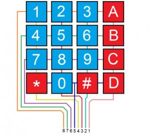
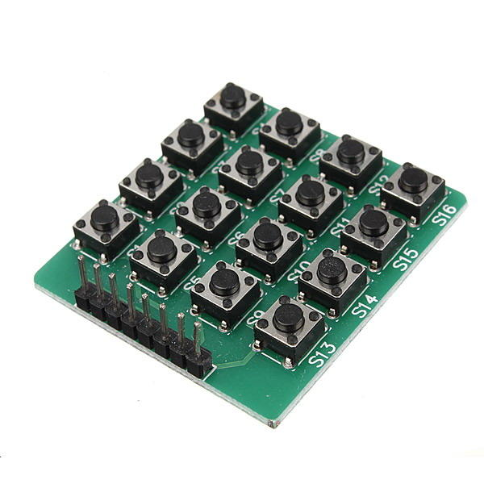
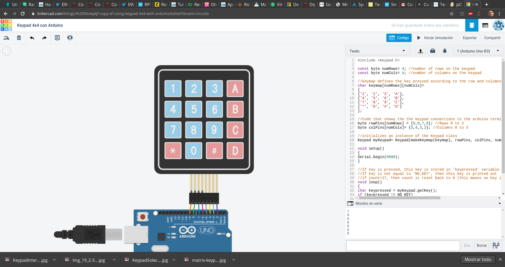
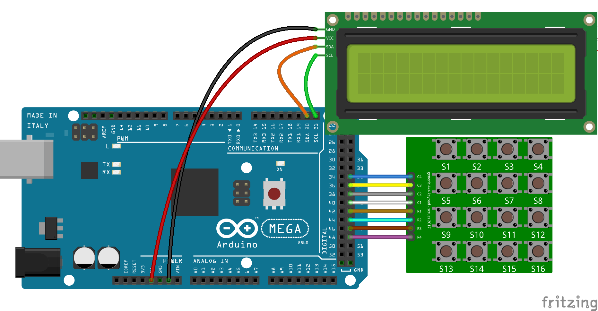

# Uso de teclados (Keypad)  

Un teclado (keypad) no es otra cosa que una matriz de pulsadores que están conectados de manera que se necesiten pocos pines para detectar cuando se ha pulsado alguno de ellos.


Internamente son así:







Conectaremos los pines, por ejemplo de esta forma



Y usaremos la librería [Keypad](https://playground.arduino.cc/Code/Keypad/)

```C++

#include <Keypad.h>

const byte numRows= 4; //number of rows on the keypad
const byte numCols= 4; //number of columns on the keypad

//keymap defines the key pressed according to the row and columns just as appears on the keypad
char keymap[numRows][numCols]= {
                {'1', '2', '3', 'A'}, 
                {'4', '5', '6', 'B'}, 
                {'7', '8', '9', 'C'},
                {'*', '0', '#', 'D'}
            };

//Code that shows the the keypad connections to the arduino terminals
byte rowPins[numRows] = {9,8,7,6}; //Rows 0 to 3
byte colPins[numCols]= {5,4,3,2}; //Columns 0 to 3

//initializes an instance of the Keypad class
Keypad myKeypad= Keypad(makeKeymap(keymap), rowPins, colPins, numRows, numCols);

void setup(){
Serial.begin(9600);
}

//If key is pressed, this key is stored in 'keypressed' variable
//If key is not equal to 'NO_KEY', then this key is printed out
//if count=17, then count is reset back to 0 (this means no key is pressed during the whole keypad scan process
void loop(){
    char keypressed = myKeypad.getKey();
    if (keypressed != NO_KEY){
        Serial.println(keypressed);
    }
}
```

### Ideas

* Añadir un LCD para mostrar las pulsaciones 
* Calculadora



* Alarma

## Más detalles

[Teclados matriciales por Prometec](https://www.prometec.net/teclados-matriciales/)
[Teclados matriciales por Luis Llamos](https://www.luisllamas.es/arduino-teclado-matricial/)
